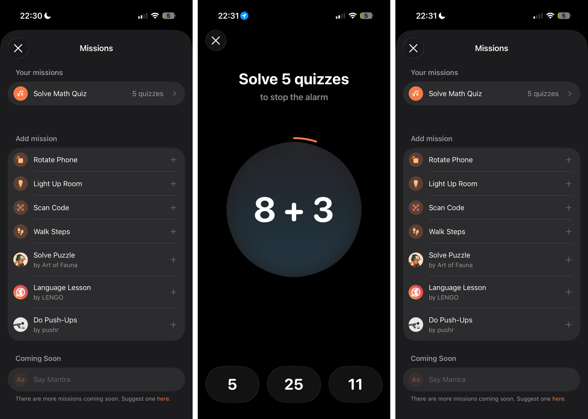

I heard about an app called [Awake](https://apps.apple.com/us/app/awake-smart-alarm-clock/id6747604910) [on MacStories](https://www.macstories.net/news/awake-a-considered-effective-alarm-for-chronic-snoozers/). It's an alarm clock app, which is specifically designed for heavy sleepers, or people who tend to enjoy pressing the snooze button in the morning. People like me.

 

There are three main parts of the app: your schedule, missions, and morning briefing. 

I haven't used that many alarm apps, so I don't know if this is a common feature, but I really like the schedule feature. I work from home on some days, go to the office on others, and enjoy more sleep on the weekend. And I'd rather not need to manually set this every night. 

For times when you've stayed up a bit later than planned, the app will notice if you are past your estimated bedtime, and help to push back your alarm temporarily to ensure you get your ideal sleep time. That's pretty neat.

Now for the core of the app, the missions. These are essentially actions that will happen automatically, or activities that you need to complete in order to turn your alarm off in the morning.

I went with something simple, just five very basic maths questions. As my aim isn't to do anything spectacular, I just need my brain to be activated just that little bit, in order to help me to wake up. Otherwise, I'm going back to sleep. 

As for the morning briefings, this isn't something that I've particularly used. I have it show me the weather and my calendar. But I don't tend to have much in my personal calendar, and the weather in Britain tends to be the same most days. But they do have a to-do app called Structured which can also be added here, so that is something I may look into soon.

But for the alarm clock itself, I have to say that I'm very pleasantly surprised with how effective it's been. I've used it since mid-December last year when the review was posted on MacStories, and for a while I still had an additional alarm set in the iOS Alarm app just as a backup. But it's never been needed. I just use [Awake](https://apps.apple.com/us/app/awake-smart-alarm-clock/id6747604910).

Previously, I found it pretty hard waking up on days where I travelled to the office, as that meant getting up around 6:30 to 7:00. That used to require multiple staggered alarms to ensure that a little extra snooze didn't mean I was suddenly super late for work. But now I get one alarm, I do my little maths questions, then I get up. Because otherwise, that second alarm sound is loud!